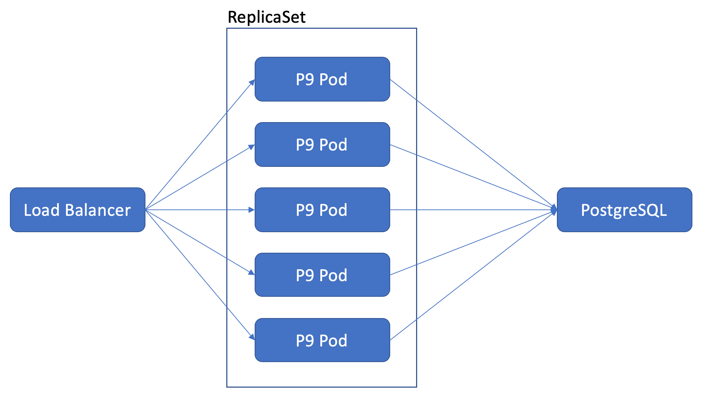
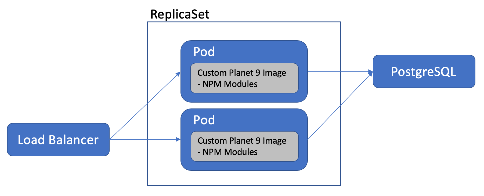

# Planet9 & Kubernetes

If still any questions remain after reading this document, or linked documents, contact me via `ian@neptune-software.com` regarding any questions.

## Summary

This repo contains different samples to showcase how you can deploy a Planet9 instance with Kuberenetes. 

In addition to this documentation, we strongly suggest to read the ["Planet 9 installation guide"](https://www.neptune-software.com/download-your-trial/) first.

## Docker Image

The Planet 9 docker image is hosted on [Docker Hub](https://hub.docker.com/r/neptunesoftware/planet9).
You can find the name and tags on Docker Hub.

# Architecture

Everything (aside of NPM Modules) in Planet 9 is persisted in the underlying database. Therefore you can use a `ReplicaSet` for deploying multiple Planet 9 pods, as long all Pods connect to the same database.



You have the liberty to hosts your database within Kubernetes. If you have limited skills available regarding databases, we advise to consider using cloud managed databases as hosting databases with High Availability and Disaster Recovery in mind is an expertise on its own.

Planet 9 is a Node application that forks child processses to locally load balance within the Planet 9 instance. The amount of child processes can be configured (see configuration). The more processes you run, the more vCPU's you should consider to allocate to your pods.

## NPM Modules

A feature of Planet 9 is that you can use NPM modules for server scripts. The path to these NPM modules can be configured in the cockpit. When using Kubernetes, we prefer stateless apps. Theferefor we advice to persist the NPM modules in one of the following ways:

* Create your own custom Planet 9 Docker Image, based on the Planet 9 Docker image and include the NPM modules that you use. Use your customized Docker Image for the Pods.

* Use a shared persisted volume that you mount to the Planet 9 container. Make sure to use a shared storage type (e.g. AWS EFS, Azure Files). Mount the PersistentVolume/PersistentVolumeClaim to the path that is configured in the Planet 9 cockpit. This NPM Path setting is stored in the database. So all Planet 9 instances that use the same database will have the same NPM path setting.


# Examples

Here are a few examples on deploy Planet 9 within kubernetes. Configuring security (e,g, RBAC, Policies, etc...) and hosting of databases is out of scope in this document.

All examples use the same `requests` and `limits` settings. They are just arbitrary set values. Each Planet 9 application and API is unique in it's own way, translating in different needs for required compute resources. Based on monitoring, we advice to finetine the compute resources you need to allocate to your pods.

## Example 1: Basic

See `samples/sample-1/deployment.yml`

The most basic Planet 9 deployment fronted with a Load Balancer.

**Example Characteristics**
* 1x Planet 9 instance in one ReplicaSet.
* Database used is SQLite, and non persistent.
* Custom NPM Modules are non persistent.
* Planet 9 is available on port `8080` via the Public IP of the LoadBalancer. 
    * You can find this IP address via with the `kubectl get svc` command.

## Example 2: Configure Database

See `samples/sample-2/deployment.yml`

A Planet 9 deployment with multiple pods, all using the same database fronted with a Load Balancer. Example shows how to configure environment variables.

**Example Characteristics**
* 3x Planet 9 instances in one ReplicaSet.
* Database used is PostgreSQL, and peristing.
* Custom NPM Modules are not persist.
* No `secrets` are used in this.
* Planet 9 is available on port `8080` via the Public IP of the LoadBalancer. 

## Example 3: Shared Volume For Custom NPM Modules (AKS)

See `samples/sample-3/deployment.yml`

A Planet 9 deployment with multiple pods, all using the same database fronted with a Load Balancer. Example shows how to configure the shared PersistentVolume for NPM modules.

his example is with AKS for the Kubernetes Cluster and uses Azure Files as PersistentVolume provider.

Once the deployment is running, make sure to set the custom NPM path in the Planet 9 cockpit (Settings > Customizing > General > Custom NPM Installation Path). Based on the example `deployment.yml`file, the value should be `/home/planet9/customnpm` .

**Example Characteristics**
* 3x Planet 9 instances in one ReplicaSet.
* Database used is PostgreSQL, and peristing.
* Custom NPM Modules are persisted.
* No `secrets` are used in this.
* Planet 9 is available on port `8080` via the Public IP of the LoadBalancer. 

## Example 4: Using Secrets 

See `samples/sample-4/deployment.yml`

A Planet 9 deployment with multiple pods, all using the same database fronted with a Load Balancer. Example shows how to configure secrets.

Before applying/creating the deployment, create a secret for the DB user and Password:
```bash
kubectl create secret generic db-user-pass \ 
    --from-literal=dbuser=MyDbUser \
    --from-literal=dbpass='MyDbUserPassword'
```

**Example Characteristics**
* 3x Planet 9 instances in one ReplicaSet.
* Database used is PostgreSQL, and peristing.
* Custom NPM Modules are not persist.
* `secrets` are used to secure sensitive credentials.
* Planet 9 is available on port `8080` via the Public IP of the LoadBalancer. 